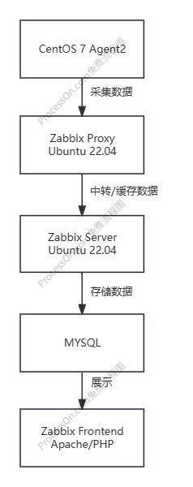
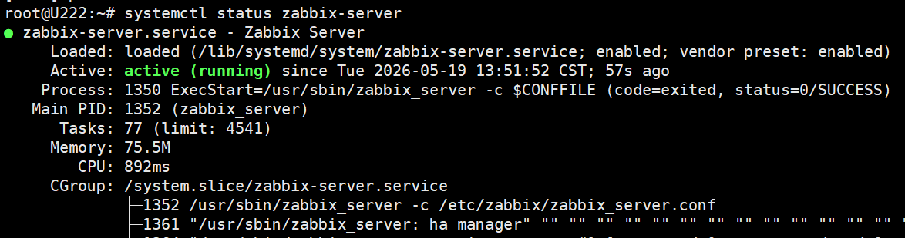
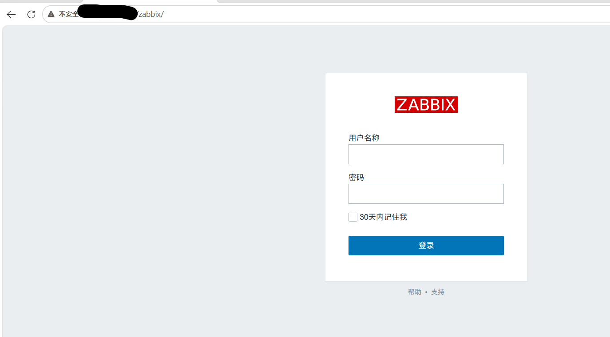
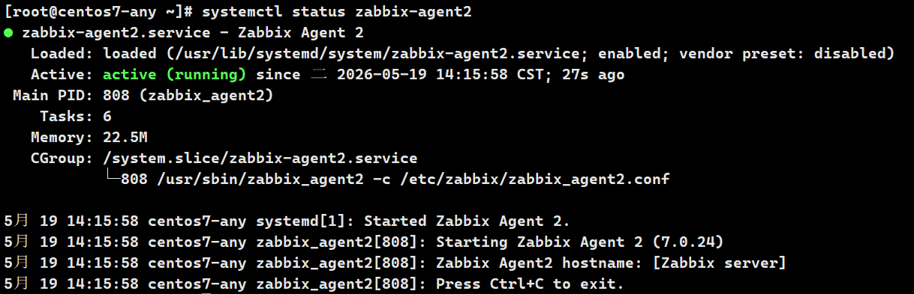
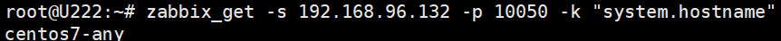

\# Linux Server Monitoring Practice with Zabbix

基于 Zabbix 7.0 搭建的 Linux 服务器监控实践项目。

## 01 项目实现

\- Zabbix Server 部署
\- Agent2 主动模式监控
\- Proxy 部署
\- Web 前端配置
\- MySQL 数据库存储
\- 服务监控与状态采集
\- 异常问题排查与恢复

用于学习企业级监控平台部署、Linux 服务管理与监控系统运维流程。

## 02 架构



## 03 功能

- Zabbix Server 部署
- Agent2 主动式监控
- Zabbix Proxy 部署
- Linux 服务器资源监控
- CPU / 内存 / 磁盘监控
- Web 仪表盘监控
- 使用 MySQL 存储监控数据

## 04  环境

- zabbix 7.0
- centos 7 （agent）
- ubuntu 22.04 （server/proxy）
- MySQL
- Linux

## 05 快速部署

- 安装 zabbix-server 需要的依赖包。

```BASH
wget https://repo.zabbix.com/zabbix/7.0/ubuntu/pool/main/z/zabbix-release/zabbix-release_7.0-1+ubuntu22.04_all.deb
sudo dpkg -i zabbix-release_7.0-1+ubuntu22.04_all.deb
sudo apt update
```

- 安装 zabbix server

  ```bash
  sudo apt install zabbix-server-mysql zabbix-frontend-php zabbix-apache-conf zabbix-sql-scripts zabbix-agent2
  ```
  
- 创建数据库和用户。

  ```MYSQL
  create database zabbix character set utf8mb4 collate utf8mb4_bin;
  CREATE USER 'zabbix'@'localhost' IDENTIFIED BY '你的密码';
  GRANT ALL PRIVILEGES ON zabbix.* TO 'zabbix'@'localhost';
  FLUSH PRIVILEGES;
  ```

- 导入数据库结构（初始化SQL）

  ```BASH
  sudo zcat /usr/share/zabbix-sql-scripts/mysql/server.sql.gz | mysql --default-character-set=utf8mb4 -u zabbix -p Yourpassword
  ```

- 启动服务

```bash
systemctl start zabbix-server
systemctl enable zabbix-server
```

- 访问web界面

```BASH
http://IP地址/zabbix
```

更多的安装细节和故障排查，请参考:

- docs/install-server.md
- docs/troubleshooting.md

## 06 截图

- 成功启动 zabbix-server



- 访问web界面



- 成功启动 zabbix-agent2



- 验证 zabbix-server 是否能成功获取到 agent2 的信息


